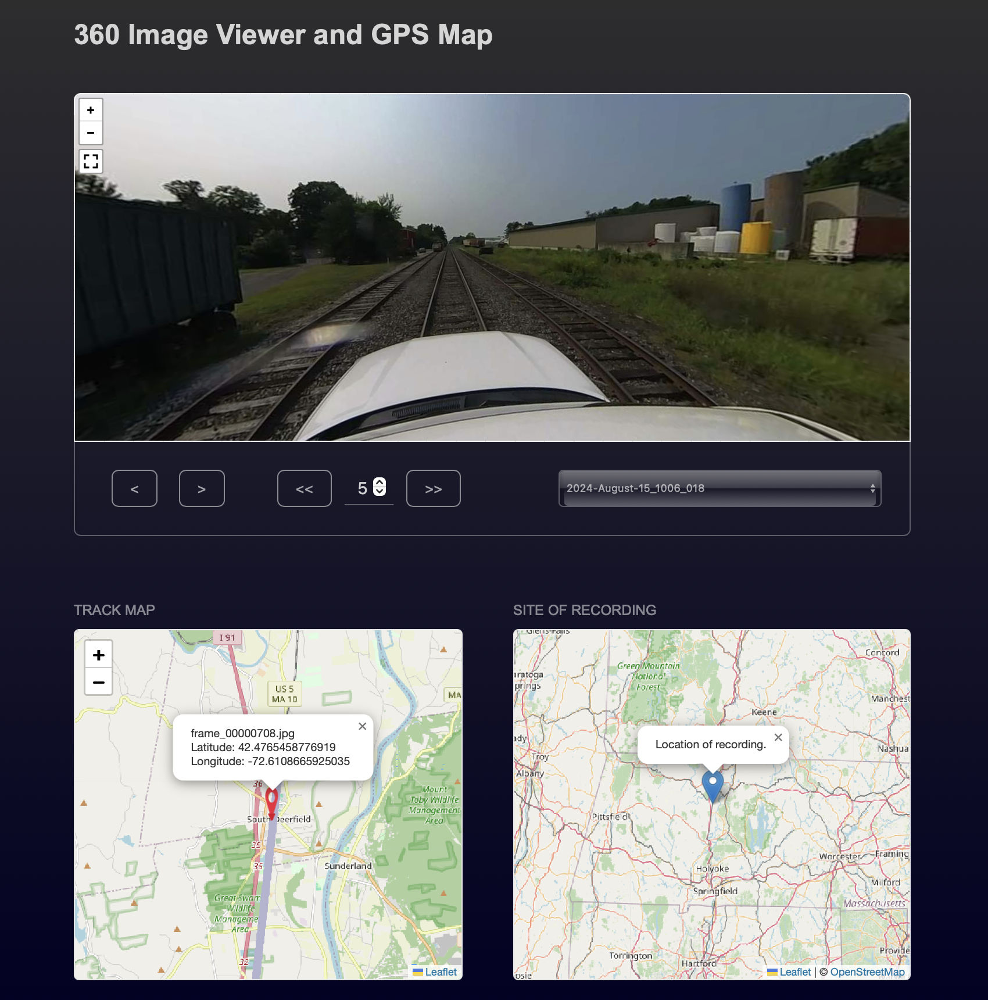
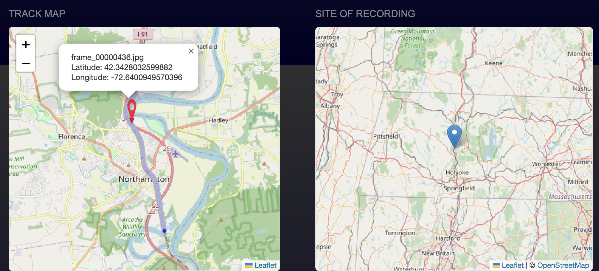
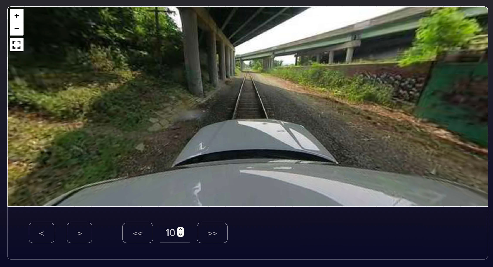

# Train 360° Video Viewer

## Overview
This project provides an interactive web-based viewer for 360° video frames recorded from the top of moving trains. The interface displays:
- **360° video frames** from different points along the railway track.
- **A detailed train path map** with clickable points to navigate to corresponding video frames.
- **A state-level map** showing the geographic location of the recorded data.

- **Full Webpage View**:
  

A **Python pipeline** has been developed to extract frames and corresponding GPS coordinates for each frame.

## Features
- **Interactive Path Navigation**: Click on any point on the train's path to view the corresponding video frame.
- **360° Video Frame Display**: Users can examine frames recorded from the train’s perspective with navigation controls.
- **Dual Map Visualization**: The webpage features two maps:
  - One showing the exact path of the train.
  - Another providing a broader state-level context of where the recording was done.
- **User-Friendly Interface**: Navigation buttons allow easy exploration of video frames.

- **Maps Section**:
  
- **360° Frame View with Navigation**:
  

## Benefits
### **Railway Accessibility Analysis**
- Helps assess accessibility to train tracks from surrounding areas.
- Identifies potential risk areas where unauthorized access is easier.

### **Trespassing and Safety Assessment**
- Provides visual evidence of locations where people might be trespassing on tracks.
- Can be used to study patterns of unauthorized access and plan safety interventions.

### **Infrastructure Inspection**
- Assists in reviewing track conditions and nearby infrastructure.
- Can support maintenance planning by visualizing key problem areas.

### **Urban and Rural Planning**
- Useful for transportation authorities to understand how rail corridors interact with surrounding environments.
- Supports decision-making for station placement and urban planning near railway lines.

## Usage
1. Open the webpage in a browser.
2. Click on any point along the path on the map to view the corresponding 360° frame.
3. Use the navigation buttons to move between frames.
4. Refer to the state-level map for broader geographic context.

## Repository
The source code is hosted on GitHub. Clone the repository and explore the code to modify or enhance functionality.

```bash
# Clone the repository
git clone https://github.com/z00bean/360-track-viewer.git
cd your-repo
```

## Contributions
Feel free to contribute by reporting issues, suggesting improvements, or adding new features via pull requests.

---
This project aims to enhance railway safety and accessibility studies through an interactive and immersive visualization tool.
