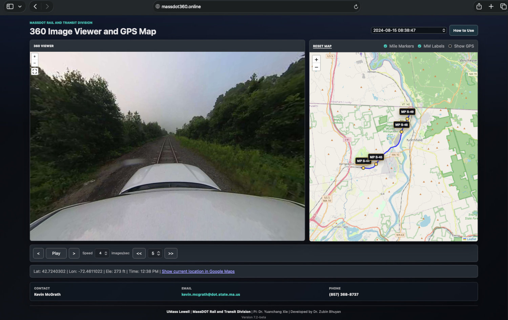

# Train 360° Video Viewer

## Overview

This project provides an interactive web-based viewer for 360° imagery recorded from the top of moving trains. The interface combines panoramic rail corridor imagery with GPS trajectory information to support visual review of railway corridors and their surrounding environments.

The viewer provides:

- **360° rail corridor imagery** at different locations along a recorded route.
- **GPS trajectory mapping** synchronized with the currently displayed 360° image.
- **Interactive playback and navigation controls** for moving through recorded image sequences.
- **Railway mile markers** that can be displayed alongside the recorded trajectory.
- **Direct Google Maps links** for viewing the current GPS location.

**URL:** http://massdot360.online | https://d1y838evkona2g.cloudfront.net

- **Full Webpage View**:  
  

A **Python processing pipeline** has been developed to extract 360° frames and corresponding GPS coordinates from the recorded data for use in the web viewer.

## Features

- **Recording Selection**: Select available recordings using the dropdown menu. The recording label indicates the time when the recording started.
- **360° Image Viewer**: Click and drag within the panoramic image to look around the scene. Use the mouse wheel or trackpad to zoom in and out.
- **Playback Controls**: Play or pause the recorded image sequence and adjust the playback speed.
- **Frame Navigation**: Move forward or backward one image at a time or jump multiple images using a configurable step size.
- **Interactive GPS Trajectory Map**: The trajectory map shows the route associated with the selected recording and updates as the displayed image changes.
- **Current Location Indicator**: A red marker identifies the GPS location corresponding to the currently displayed image.
- **Railway Mile Markers**: Mile posts near the trajectory can be shown or hidden. Mile marker labels can also be independently controlled when the markers are visible.
- **GPS Information**: The current image location and GPS coordinates are displayed below the viewer controls, with a link for opening the location in Google Maps.
- **Map Controls**: The trajectory map can be reset to its original view, and GPS labels and mile marker information can be shown or hidden as needed.

- **Maps Section**:  
  

- **360° Frame View with Navigation**:  
  

## Usage

1. Open the webpage in a laptop or desktop web browser.
2. Use the **dropdown menu in the top right** to select a recording.
3. Wait for the 360° imagery and GPS trajectory to load.
4. Click **Play** to begin playback.
5. Click **Pause**, or press **Space** or **P**, to pause or resume playback.
6. Adjust the **Speed** setting to change the playback rate.
7. Use **>** and **<** to move forward or backward one image at a time.
8. Use **>>** and **<<** to jump forward or backward by the selected step size.
9. Click and drag inside the 360° viewer to change the viewing direction, and use the mouse wheel or trackpad to zoom.
10. Use **Mile Markers** and **MM Labels** to control the display of railway mile posts and their labels.
11. Use **Show GPS** to show or hide the current GPS label.
12. Use the current-location link to open the displayed coordinate in Google Maps.
13. Click **Reset Map** to return the trajectory map to its original view.

> **Note:** The website is best viewed on a laptop or desktop computer. Navigation may be more difficult on a mobile phone or smaller screen because the 360° viewer and map are designed for detailed visual review.

## Applications and Value

### Remote Corridor Review and Work Planning

- The viewer is currently used by contractors and personnel involved in planning work along the railway corridor.
- Users can visually review a section of railway and its surroundings before conducting a field visit.
- This can reduce the need for preliminary site visits when the required information can be obtained from the 360° imagery.
- Location-referenced imagery helps users understand access points, surrounding terrain, nearby infrastructure, vegetation, crossings, and other site conditions relevant to planning work.

### Contract Planning and Estimation

- Contractors and prospective bidders can use the viewer to better understand existing site conditions when planning or estimating work along the corridor.
- The imagery can provide useful context for estimating the type of environment, accessibility, potential constraints, and equipment or resources that may be required.
- For example, a contractor planning to install **fiber-optic cable along the railway corridor** can review the route in advance to understand the surrounding area, trackside conditions, access, and potential installation constraints.
- The viewer can supplement drawings, maps, and other project information during preliminary planning and cost estimation.

### Railway Accessibility Analysis

- Helps assess accessibility to railway tracks from surrounding areas.
- Identifies potential locations where unauthorized track access may be easier.

### Trespassing and Safety Assessment

- Provides visual information that can support the assessment of potential trespassing locations.
- Can assist in studying railway corridor conditions and planning safety interventions.

### Infrastructure Inspection

- Supports visual review of track conditions and nearby infrastructure.
- Can assist maintenance and field assessment by providing location-referenced panoramic imagery.

### Transportation and Corridor Planning

- Helps transportation agencies understand how railway corridors interact with surrounding environments.
- Provides geographically referenced visual information that can support transportation, infrastructure, and corridor planning.

---

**UMass Lowell | MassDOT Rail and Transit Division**

**Principal Investigator:** [Dr. Yuanchang Xie](https://www.uml.edu/engineering/civil-environmental/faculty-staff-students/faculty/xie-yuanchang.aspx)

**Developed by:** [Dr. Zubin Bhuyan](https://zubinb.com/)
